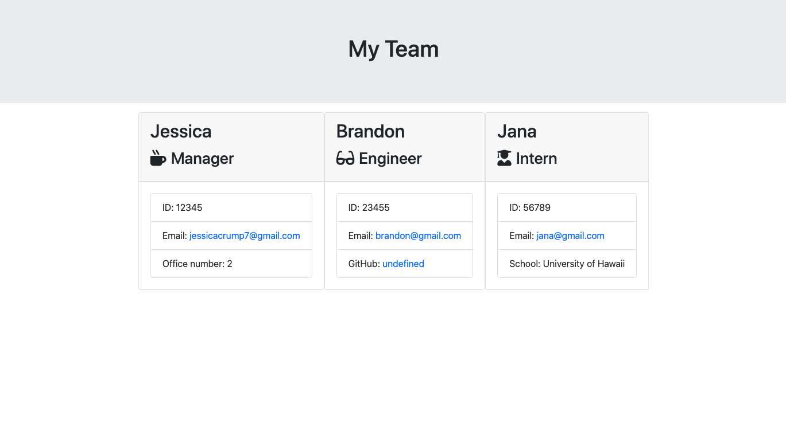

# team-builder

## Table of Contents 

* [Installation](#installation)
* [Usage](#usage)
* [Credits](#credits)
* [License](#license)
* [Contributing](#contributing)

## Installation
  
One can fork from this repository and clone it to their machine. From there, the program can be initated from the terminal with "node app.js". Below is a demonstration of how to begin using the app following the fork and clone of the repository to one's local machine. 

## Usage 

One may use this app to build a roster for their team or employee base. This provides a simple, easy way to create a good looking database of employees or whatever group you may be creating it for. It also provides a localized place to reference the rank, position, or personal information about the group or individuals in the group. The use of the app is quite simple: the user is prompted with a series of questions after running node and the answers are subsequently populated into a page. 

Below is an example of the output of the application. 

## Credits 

The app was created using [Node.js](Nodejs.org). 

## License 

This project has an MIT license. 

